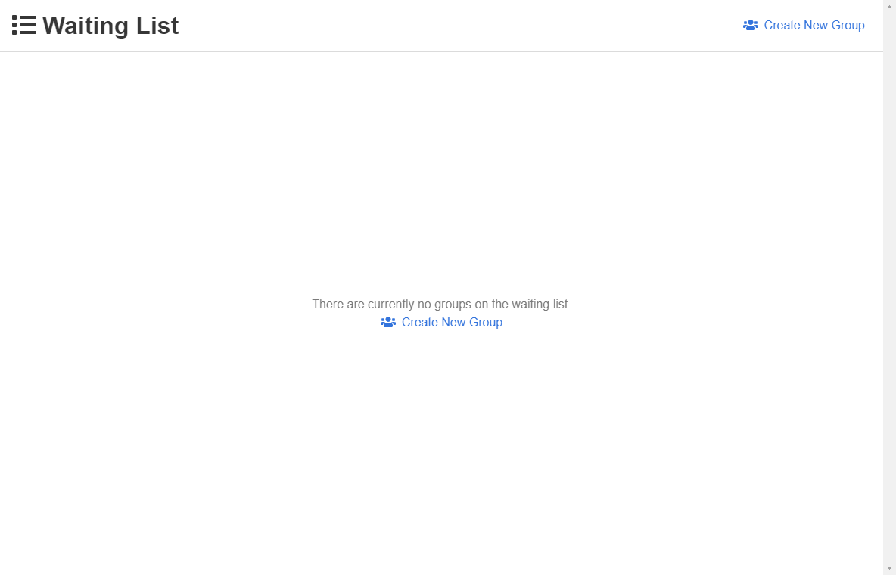

# Waiting List

This is a simple waiting list app using Vue.js, Bulma, Electron, and Twilio.  



## Table of Content
- [Custom Configuration](#custom-configuration)
  - [Twilio Data](#twilio-data)
  - [Company Data](#company-data)
  - [Icon](#icon)
- [Testing](#testing)
- [Building](#building)
- [Todo](#todo)

## Custom Configuration

The application allows for the configuration from a public configuration file `./public/config.json`:
```
{
  "twilioData": {
    "accountSid": "YOUR_ACCOUNT_SID",
    "authToken": "YOUR_AUTH_TOKEN",
    "fromNumber": "YOUR_TWILIO_NUMBER",
  },
  "companyData": {
    "companyName": "YOUR_COMPANY_NAME",
    "waitTime": "YOUR_WAIT_TIME",
    "isMessageEditable": "IF_THE_MESSAGE_SENT_IS_EDITABLE",
    "message": "THE_MESSAGE_TO_BE_SENT"
  }
}
```

### Twilio Data

Twilio Data contains all of the information required to send a message through their API.
- **accountSid** -> *String* : The SID of your Twilio account
- **authToken** -> *String* : The authentication token from your Twilio account
- **fromNumber** -> *String* : The phone number associated with your Twilio account

### Company Data

Company Data contains all of the information pertaining to the settings of the application specific to your company.
- **companyName** -> *String* : The name of your company
- **waitTime** -> *Number* : The amount of time until their reservation will be ready
- **isMessageEditable** -> *Boolean* : Whether the text message sent is editable or not
- **message** -> *String* : The text message body that will be sent

### Testing

Run `npm run electron:serve` to host a local development environment.

### Icon

Save a `.png` image within the `./public/` folder as `icon.png`.  After this run the `npm run electron:generate-icons` script.

## Building

Execute the `npm run electron:build -- --win nsis --x64 --ia32` script.  **Currently this is only built for Windows.**

## TODO

- [ ] Add accessibility options

